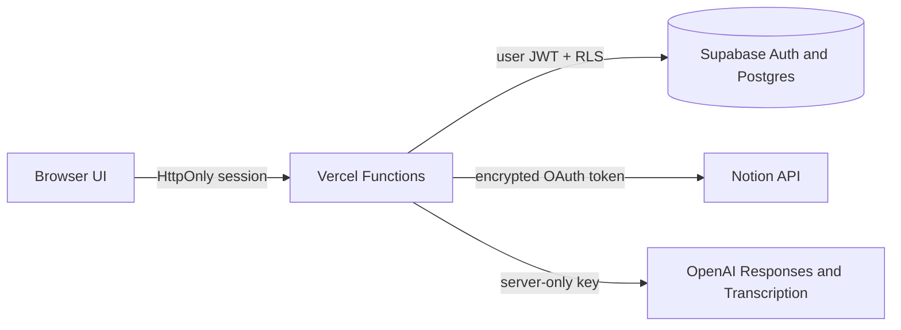

# Agent One

**Your workspace, understood and operated by AI.**

[](https://arshad-os-oauth-arshad8.vercel.app/)
[](https://github.com/arshadrabbanipune-bot/agent-one/actions)
[](https://arshad-os-oauth-arshad8.vercel.app/)

Agent One is a secure, Vercel-native workspace agent. It signs users in through Supabase, connects only the Notion pages they approve, renders the real workspace hierarchy as an interactive map, and provides an English/Hindi/Hinglish voice and typed assistant.

## What Agent One does

- Authenticates users with Google or email through Supabase Auth.
- Connects each user's Notion workspace through real OAuth consent.
- Builds an interactive map from approved pages, databases, data sources, and rows.
- Uses voice or text to inspect and safely update existing Notion content.
- Verifies writes, prevents duplicates, keeps audit history, and supports confirmation and undo.
- Keeps OpenAI, Notion, encryption, and session secrets exclusively on the server.

## Live product

Open the production app: **[Agent One](https://arshad-os-oauth-arshad8.vercel.app/)**

## Architecture



- The browser never receives `OPENAI_API_KEY`, `NOTION_CLIENT_SECRET`, `AUTH_SECRET`, `TOKEN_ENCRYPTION_KEY`, or the Notion access token.
- Notion tokens are AES-256-GCM encrypted before Supabase storage.
- Supabase RLS restricts connections, assistant settings, run history, and audit actions to `auth.uid()`.
- OpenAI receives bounded, sanitized Notion results. Notion content is treated as untrusted data.
- Every write is inspected, deduplicated, verified, audited, and assigned an idempotency key. Destructive or broad changes require confirmation; supported changes expose undo.

## Local setup

1. Copy `.env.example` to `.env.local` and fill only server-side values.
2. In Supabase Auth, enable Google and add the production callback required by Supabase.
3. In the Notion integration, register `https://arshad-os-oauth-arshad8.vercel.app/api/auth/notion/callback`.
4. Apply the SQL migrations in `supabase/migrations`.
5. Link the directory to the `arshad-os-oauth` Vercel project.

Never prefix secrets with `VITE_`, `NEXT_PUBLIC_`, or expose them in client JavaScript.

## Required server environment variables

Use `.env.example` as the reference. Configure values in Vercel and local `.env.local`; never commit real credentials.

- `APP_URL`
- `AUTH_SECRET`
- `TOKEN_ENCRYPTION_KEY`
- `SUPABASE_URL`
- `SUPABASE_ANON_KEY`
- `SUPABASE_SERVICE_ROLE_KEY`
- `GOOGLE_CLIENT_ID` and `GOOGLE_CLIENT_SECRET`
- `NOTION_CLIENT_ID` and `NOTION_CLIENT_SECRET`
- `OPENAI_API_KEY`

## Verification

```text
npm test
npm run lint
npm run typecheck
npm run build
npx vercel --prod
```

The assistant supports microphone recording through `MediaRecorder`, protected server-side transcription, streamed progress, typed fallback, cancellation, confirmation, history, and speech responses. Saved settings map the user's Daily Entry, map object, date/title fields, timezone, and preferred insertion behavior without inventing Notion content.

## Production routes

- `/api/auth/google` and `/api/auth/google/callback`
- `/api/auth/notion` and `/api/auth/notion/callback`
- `/api/auth/me`, `/api/auth/logout`, `/api/auth/notion/disconnect`
- `/api/notion/map` (`/api/notion/sync` is a compatibility rewrite)
- `/api/assistant?action=transcribe|run|confirm|undo|settings|history`

If a provider flow fails, first verify `APP_URL`, the exact callback URL, and the corresponding Vercel Production environment-variable names. Do not log secret values.

## Security

Please review [SECURITY.md](SECURITY.md) before deploying a fork. Report vulnerabilities privately rather than opening a public issue with sensitive details.

## Status

Agent One is under active development. The production app is live, while authentication, workspace mapping, safe Notion actions, and voice workflows continue to be hardened for broader use.
